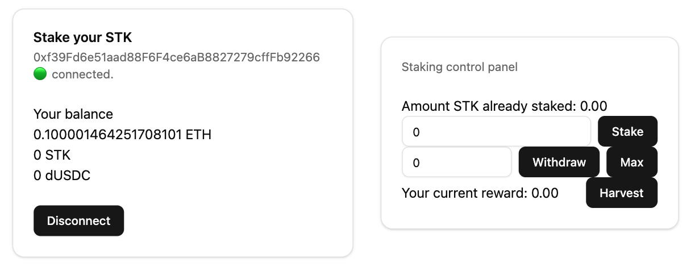

SimpleStaking

This smart contract allows users to stake a specific token(SimpleToken is used here for exemplification) and earn rewards over time.
Inspired by Synthetix staking algorithm, this contract ensures fair reward distribution by tracking staking timestamps and accumulated rewards. "Pull over push" pattern is used in order to shift the risk associated with transferring ether to the user. Functionalities are kept to a minimum as it is just intended to demonstrate how the alghoritm work.

The frontend uses wagmi + privy libraries in order to facilitate user interaction with the contract. User must first connect his wallet, then he can stake, withdraw or harvest the rewards.

